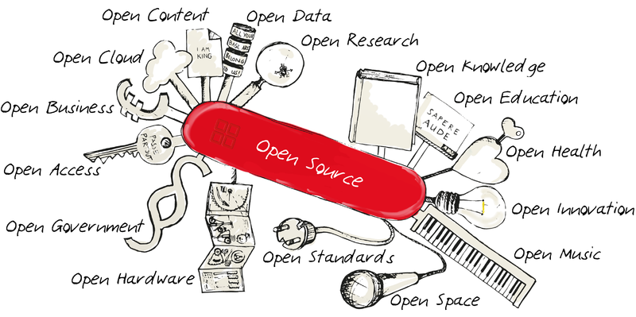
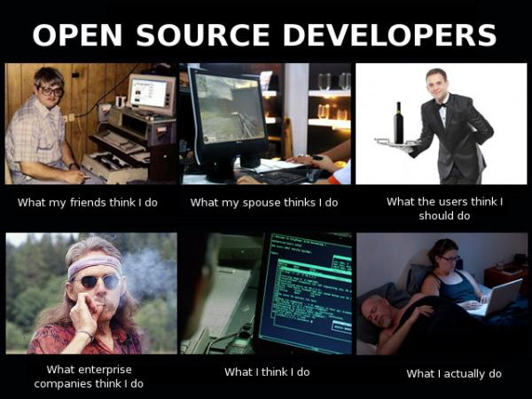
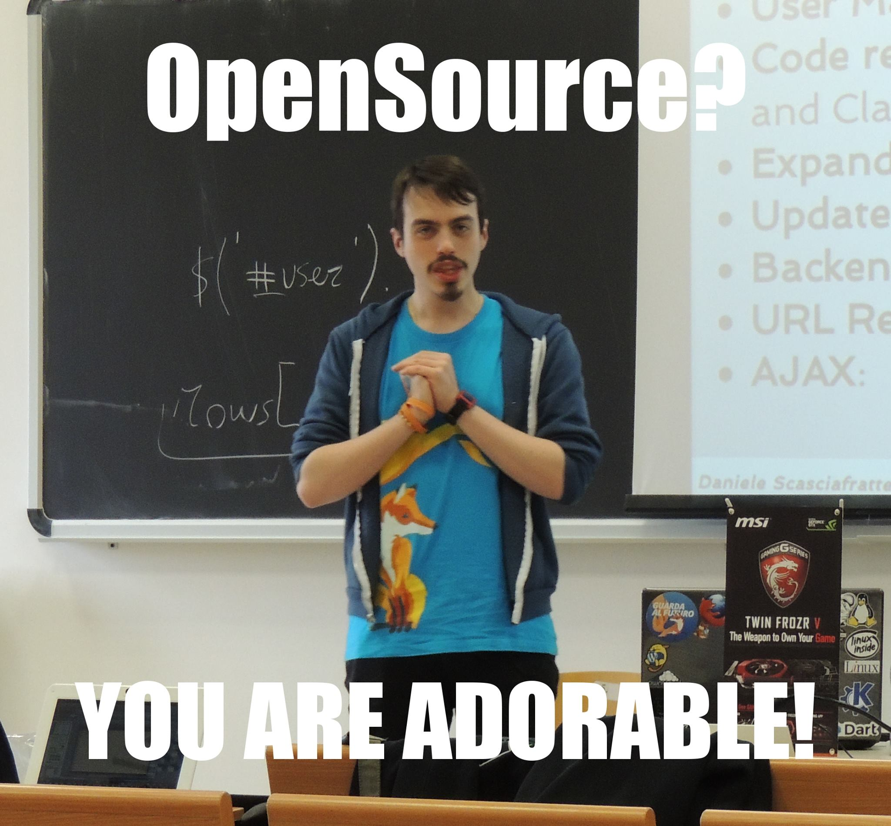
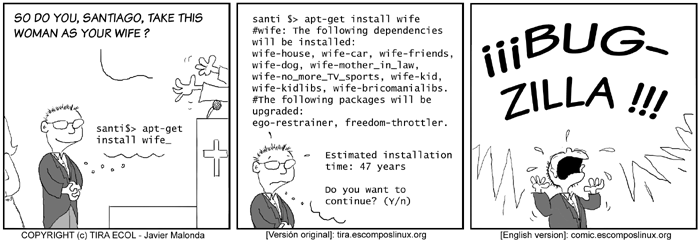
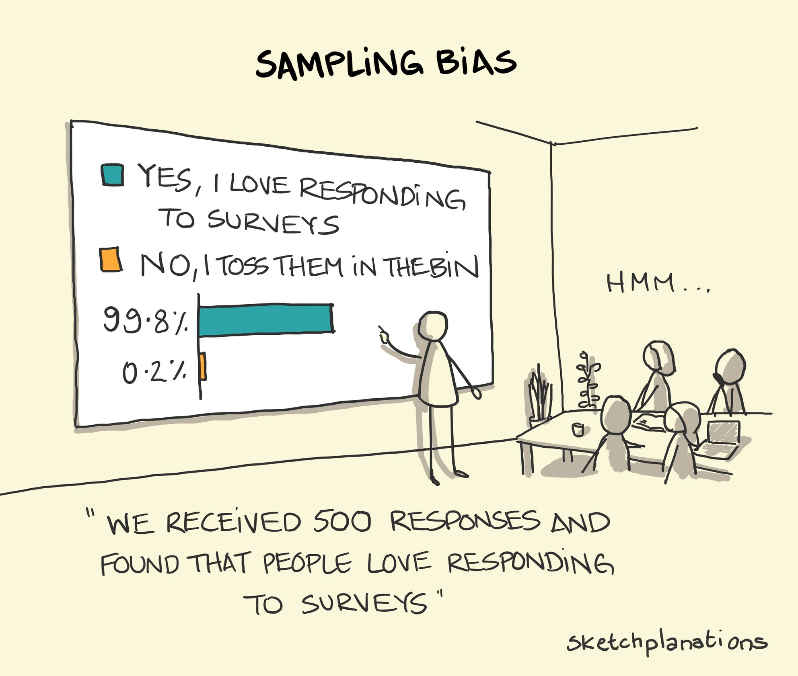

-# My (or your new) philosophy

If you are still reading this pages it means you found them interesting/useful, or you think first chapters do make sense..  
Let's speak about the Philosophy now, I don't want to cover the four freedoms in depth here (for there are articles covering this topic already), but you will find a brief recap below.  

I># The 4 freedoms of Open Source software/projects
I> * The freedom to run the program as you wish, for any purpose (freedom 0).
I> * The freedom to study how the program works, and change it so it does your computing as you wish (freedom 1). Access to the source code is a precondition for this.
I> * The freedom to redistribute copies so you can help others (freedom 2).
I> * The freedom to distribute copies of your modified versions to others (freedom 3). By doing this you can give to the whole community a chance to benefit from your changes. Access to the source code is a precondition for this.
I>
I> From: [https://www.gnu.org/philosophy/free-sw.en.html](https://www.gnu.org/philosophy/free-sw.en.html)

This 4 freedoms created the philosophy and the open source model.  

  

I> Open source model examples: Open Hardware (Arduino or Raspberry Pi except for CPU), Open Content (Creative Commons license), Open Knowledge (Wikipedia or Project Gutenberg), Open Data (OpenStreetMap), Open Access (Open Document File formats)

We need to exclude the biggest metropolitan legend about this topic: open source doesn't mean that it is free of charge (also if everyone use OSS, including enterprise). This point is very difficult to understand for newcomers and if you have troubles, well check it out reading the rest of this chapter.  
Another important benefit of Open Source is that you are getting in addition to the product a bonus, the access to the various pieces that build it. It is like getting a pizza but also the recipe with the various information for any ingredient and so on. For a non-technical person this can be useless but when you need to study how works or implement based on the requirements of your customer is very important because let you to do a full analysis.

I> Good artists copy; great artists steal.
I> From: [https://quoteinvestigator.com/2013/03/06/artists-steal/](https://quoteinvestigator.com/2013/03/06/artists-steal/)
I> In the IT world there is another version: "Reinventing the wheel" but I prefer to add also "What is not understood is not possessed" of Johann Von Goethe to help you understand the philosophy.

The seven stages of Grief is a way to express the various steps of a loss, anyway someone converted as [Seven stages of OpenNess](https://coiled.io/blog/stages-of-openness.html) that can be used as mnemonic to understand how the Open Source process can change your view on doing and understand FOSS (read this link before this chapter if you want to see other opinions). Another idea that surprised me is the boy-scout rule "Always leave the campground cleaner than you found it", that is part of what I do in Open Source and this book is part of.

So Open Source != Free Software, this means that open source is a subset or a minimal definition of the goals of a project compared to Free Software. This happen about the *free* in Free Software because as we said open source means that the code is available but what you can do with that depends on the license that can be Free Software, or that you need to pay to access it as example. There are tons of pages that explain the difference between the various license and why but often they are very complicated, so [get ready on studying them](https://blog.graphqleditor.com/software-licensing-cheat-sheet/).  
Another opinion is by company side when the license topic is on fire, like dual licensing, CLA, abuses or license's restrictiveness but I don't want to talk about those stuff as it is the most common discussion in this world and there are people who explain a lot better than me, [Open source licensing for supervillains](https://offlinemark.com/2021/01/22/open-source-licensing-for-supervillains/).  
Yes, you need to study a bit because it easy to get a license conflict because [you like to code but you don't care of the legal part](https://arkadiuszkondas.com/dmca-php-ml-and-copyright-boundaries/).

## Do ut des

*Do ut des* is a Latin expression that means *give and take* but we can openly localize as "something is given so that something may be received in return". In English often this can be understood as *giving back*, for me this is not enough to explain it the idea behind. 
When we need a software or a service the first step we do is to look it up on the net. Then we download/register, use/consume and then move on with our day.  
We are just consumers, and often we don't know the costs involved in developing such software/service.  
When using free web services or apps, many people don't ask "how can this service continue to move on if it's free?", but it's a question we should ask ourselves.  
How Google/Facebook/Whatsapp/Youtube/Gmail etc still offer their services?  

{width=80%}

**You** are the currency, using it and leaving information in your account and surfing the web, with this information they can show to you perfect ads or discover interests your kind of person has to use it for something else.  
In the open source world this doesn't exist, a service works because some people behind it use their free time maintain it (yes, there are people paid for that sometimes). When you are using these technologies you are accessing to solutions that for you are free but behind there are many people that works to let you use them freely (classic example Wikipedia).  

Why everything starts in the open source ecosystem? Because a user sees a problem, something missing, text written badly or with typos, incomplete localization and so on.  
Basically the contribution starts when something doesn't sound so good and the issue is quite clear.   
When the problem is noticed instead of doing a useless comment online or a ranting at the pub/bar, there is an action with a report and the problem is/will be gone. This is the contributor, that enforces the contributor mode (next chapter) without noticing it just because OSS require commitment.  
This report is the first step to contribute to the project, because behind there are people that are not perfect and that can miss something.  
The society doesn't understand all of these things, maybe the 4 freedoms are more easy to accept but the commitment on something that is from the IT world is very strange. We need to help the society to understand why this commitment is important, like the civic hacking or other reality that in the IT world act to improve the quality of life using the technology.

i> Civic hacking, "enhances the relationship between the people and government with software for communications, decision-making, service delivery, and political process." [Wikipedia](https://en.wikipedia.org/wiki/Civic_technology)

Another way to see this topic is leave everything better as you found it originally.

From a company view, we need to think about another thing, **production** and **consumption** are 2 different things that require different people and skills. The idea of this book is to help address the various side of the Open Source world because a *Maintainer* cannot do everything alone.  
"[Users need open source projects, but open source projects do not need users](https://matt.life/writing/the-asymmetry-of-open-source)" this quote is from a story from an OSS project that has a company behind that reminds to everyone that a project doesn't mean that need to be suitable for everyone, also if at same time can be transparent etc.  

The maintainer is a role that is a project manager, support, developer, documentation and so on. Basically everything that start from promotion to keep the project alive, and if there is growth can share these duties to other people. It is a time consuming role and require many skills:

* Improve documentation based on your experience
* Be open to activities for other users
* Propose and try new approaches
* Be honest with/care others
* Define roadmap
* Assign tasks wisely
* Janitor tasks

And so on, but you can do those tasks and help the projects you love and improve the value over all.

In a company, this exchange of value by contributors or the future of a project is a completely different thing, for example a project can be released for [branding promotion but ignoring proposed changes](https://miles.land/posts/corporate-open-source/). It is known that company usually hire people who contributed to specific projects that they use or are focused on the area they need skilled people.  
This company projects often have difficulties on managing the open source community if they are not structured to handle external involvement, but this doesn't mean that you can't contribute to them. When you are working in these cases it is required to think in a different and more complex way, Open source is not just the 4 freedoms but also a world around visibility, promotion and business (that are not bad things) and not just transparency.  

From the Principle side, we can talk about the [Robustness Principle](https://en.wikipedia.org/wiki/Robustness_principle) in OSS. That can be translated in "be conservative in what you send, be liberal in what you accept", you are open to the world to look at what you are doing, but you don't want the involvement of everyone. This is a non-sense as per the 4 freedoms but after all you don't want trolls, bad people and so on. To move on a project you need to think in the real world where you have to chose what is better for your project to keep going on.

From a learning person or a student or someone who is looking to get experience or fill the famous curriculum, it is different. You read my biography in chapter 1 and you saw that I made myself on my own with open source but can be difficult to show this expertise outside this world. Requires personal branding but also documenting somewhere what you are doing it as you are exchanging your time on contributions to grow your knowledge and experience. There are project like [Google Summer of Code](https://summerofcode.withgoogle.com/) where students can get paid (if succeed) to contribute for a project on a specific task, and they will get a mentor or [Outreachy](https://www.outreachy.org/) that "provides internships to people subject to systemic bias and impacted by underrepresentation in the technical industry where they are living".  
Anyway it's not something new that there are projects that are opened to university/college students as there [is more attention today on the positive things that they can learn on this](https://cacm.acm.org/magazines/2021/7/253459-why-computing-students-should-contribute-to-open-source-software-projects/fulltext) and if you are reading this book probably you have already some hints.

The first interaction of an user is an opportunity to get a new contributor, so as community manager, maintainers, contributors etc is important that we offer the best experience, the best gratification we can give but also the best value both the parties can get from this action. In this book we will see a lot of suggestions, ideas and process to achieve it starting from the... reporting!

## Reporting

It seems a joke, but it's not; the real culprit is complaints have to be useful to reach a constructive goal.
Usually people stop at the very first step, without acting to make it a constructive reality. This only creates a bad mood and the effect is the opposite of the desired one.  
Give the maximum of information to developers, in order for them to research the issue, replicate it (that is a very important step) and create automated tests for it. By only complaining you obtain nothing, you just get madder than before.  
The ones able to report issues the correct way, and with much information, show a different knowledge level than others; that is a very helpful skill set to have during daily operations.

{width=60%}

Enterprises apply that way of thinking, but an open philosophy project cannot have this limits.  
You can do your part to change the world, and after some time see the problem solved thanks to your intervention! At the same time all other users will have same benefit.  
Little step for a man, huge step for humanity as a whole.  

When working with public domain resources, there shouldn't be any *omerta*, for it's against the philosophy of the open source projects itself. Everybody can do her/his own part, even with little time available or doing just little things. A puzzle is made by thousands of little pieces, and everyone can contribute competing it.  
Nothing is more distant from civics (that in Italy is very poorly understood, even if now it's mandatory to teach it in public schools).  

{width=60%}

There is also another kind of reporting, the one that can help your community on track what is happening or just gathering the common questions and write some documentation. Those are more tasks for a community manager and will be defined in other chapters on the book.

### How to do a ticket

Who manages a project often **doesn't have a lot of time** so you need to give the most possible of useful information (and not ranting). Usually *giving some example* or user case helps avoid a shallow reject and will force to read the ticket with an analysis of the details.
Basically the own vision of the problem or of the feature request is very important to give the context or user case/story. Also one ticket should address only a single topic to avoid confusions and lost of information. 
For example, they reply to your ticket after 3 months asking for more details but you remember nothing. If you wrote them easy-to-read information then your request will be processed quickly there isn't the need for further exchanges.  
The writing style should be friendly. No one wants to read rants, even if constructive ones. Also, often issues may be caused by a wrong usage of the product or by something that went unnoticed.   
This is an useful approach for support centers too, behaving in a friendly way will encourage the support reps to act friendly towards you and be more helpful than usual.  
In doubt cases, it is advisable to end the message with some polite expressions like the ones below:

* It's my first time using the project, so I am not sure...
* I am not sure to use it the right way...
* Am I doing something wrong, or is my way of handling the product correct?

This language trick allows you to make requests in a friendly way (without efforts), shows that you *desire to discover* more and makes replying to you more simple to the receivers.  
Honestly, I saw this way of expressing working wonders many times, in case of misunderstanding you may also explain that you have some issues with the language, or you may point out you are not an expert in the field, this also helps in toning down noise during discussions and engages other participants empowering them to express and explain themselves better.  

Don't forget, when you need to pose a lot of queries, it's easy for people to find you annoying, thus they behave unwelcomingly. Their time is precious, so for them collecting information and basic understanding of the issue in a timely manner is a culprit. That's why I advise you to select a friendly and informal writing style that allows you to achieve more at first approach.  

### How to reply to a ticket

If the project is our, how we should reply? Or when we contribute to the project validating the tickets (called triage) how we should reply?
Quite simple, follow the same rules, avoiding the part of the non-expert of course!  
Ask for more info, verify the request or reference to the code in the project answer (this one helps others to join and ease the task for you, basically onboarding new people) shows your own professionality and availability.  
Anyway, it's important to document also within the closing message of the ticket. The request in itself is valuable for the person invested time in redacting it and it's very awful seeing them closed with a bare "It's not our priority".  

A quickly answer often is highly appreciated because means that you are following what is happening in the project and to be very involved/interested in what is happening and fix the issue.  
Often I propose ways to accomplish my feature request or bug fix, that way I can start a discussion (and be part of it) to involve others and encourage them to do the same.  

Concluding, don't forget to take responsibility in case you are the culprit (by not reading the manual, due to misconfigurations and, so on) because you have to be honest; document the issue for someone else and simplify the job of the project manager.

## The virtuosity of reports

Let’s think for a moment to all the rants or requests we receive every day, to how much better they would be if submitted in a **constructive way**. 

{width=80%}

Gorgeous, isn’t it? Let’s take the first difficult step ourselves, let’s be ready to take it because we know how a ticket is powerful, and we know how to take it, so we can spread it to all the world and in our daily life, family, job and so on.  

On a personal level, it helps thinking in a constructive way, it helps in lifting depression and avoiding being angry with other people around us (I guess that moment before the proverbial "morning coffee" is an exception to that); it helps in making us more optimistic, it makes us grow better, when the request is well received and we wait like a child on Christmas Eve for the outcome.  
In life, when something is not working we need to be listened, but the only way to achieve that is to be constructive and available because this speeds the process up a lot, by improving communication.

Obviously, this isn’t a fool-proof method, but makes us trustable, it transforms the environment into one where interactions are productive/pleasurable/easy (when there is a shortage of time making things hectic, too!). Communicating that way also creates an “history” that may come useful in future times ahead as a reference.  

Another point if in a OSS project is not possible to do questions it isn't a real OSS project. Another view can be you can do questions but there are some choices that for [1-2-3-etc] reasons is not possible to ask again.

## How to evolve it to the next Pokemon

To open some tickets (or participate into existing ones) is very important, it allows you to get involved at a very low level and to join the party.  
For a lot of people the real question is: how I can live with that? The famous "pagnotta" already mentioned. Well, RedHat is the most profit company about Open Source (now part of IBM) released a [report of 2019-4](https://www.linuxfoundation.org/resources/open-source-guides/winding-down-an-open-source-project/) about the enterprise world revolution with FOSS.  
The main points:

* Modernized the companies
* Improved the security of their infrastructure
* Lower total costs
* Integration with others platform they use
* Ability to customize the software

Those are just few hints from this reports that show how can be powerful embrace this philosophy and solutions. For IT companies also open new doors for business like this [Tidelift's report explains to getting more developers](https://tidelift.com/subscription/managed-open-source-survey).

Let’s consider that a way to start a relationship in the way others expect this to happen, like the fish, when we move it from his tank to a new one, we make sure the temperature of the tanks is consistent and the environment is similar, to avoid it any shock whatsoever.  
The next chapter approach a bit how to improve the quality of your learnings with this new philosophy.
Now that you joined, what’s next?  
It’s up to you, doing the triage you learned more things on how the project is organized, who does what, who works on what, where to find the right people to help you without being overwhelmed by the hugeness of the community, you learned to estimate response time and also the actions you can take from there.  
Next chapter is about how to maximize the Contributor Mode.  
I call it so because I am a nerd, and probably because eating so much candies, chocolate, liquirice, fruits and the like, I get to drink not enough coffee.

For this reason, is important to consider the Bias when you are doing evaluation on FOSS, as there are tons of enthusiasts, but they are just part of your users, so they can alter your numbers and ideas very quickly. Their opinion is important but is important to have a full view.

## How to manage a new project or a legacy one

This is an hot topic today with a lot of technical debts around, old projects released [open source or to the public (two different things)](http://distractionware.com/blog/2020/01/vvvvvv-is-now-open-source/) or a project started in the company internally now is ready to be published to the OSS world. There is also the case of an [old project release with an OSI license with some changes](https://forum.defold.com/t/we-are-finally-sharing-the-defold-source-code/65177) with discussions about the declaration of opensourceness.
There are tons of article about how to manage a legacy project/codebase but I don't want to talk about those.  

The real point is that if you are starting a project is important that the code is ready from the start to be released as public just because the project rules, tickets, commits, and so on will be free of badwords (I know what happens), non-english stuff and documentation etc is ready to be released. Take as example if you are hardcoding tokens and other things that is better to avoid in your commit history, if there are issues in non-englush languages mentioned in the code that the people doesn't have access to (originally LibreOffice code had code comments in German as example from the StarOffice origins).  

I> "A security token is a peripheral device used to gain access to an electronically restricted resource." [Wikipedia](https://en.wikipedia.org/wiki/Security_token). In IT there are also token generated by apps or websites used for authentication.

The transparency of the OSS management can benefit the quality of the project itself also if internal and to new people that will work on that.  

For legacy project instead it is important to define the license, how to setup a dev environment (if it is possible), give all the information that are available and that can be helpful to run your tool. Don't be like [this (source code of XIII game that I like so much, also the comic)](https://github.com/Ch0wW/xiii_unrealscript) that doesn't include any readme or documentation.

# Conclusion

I hope that now it’s clear why Philosophy is so important: not only it differentiate us from our competitors (the non-open projects) but it’s for us a path to follow.  
Open source without understanding the philosophy or way it should be open or managed openly, is only another proprietary project hidden by the code availability. Again a project without a license is not an open source project.  
The real question could be *Why you should join a OSS project?*, let's see some points:

* Improve your knowledge in different areas
* Visibility on your field
* You can find a job or new employees
* You do something also for others
* You will see some effect of what you do in other people or areas
* Learn the rules to work with other people
* Learn how to verify the problems/issues reported
* Fight against demotivational critics
* Helps others also with code
* Learn when avoid Jargon language
* Find people similar to you
* Find mentors

I want to focus again (and I will do often in the next pages) how much an Open Source project is not just the software, but without it is empty.  
A real example is the [Jekyll case](https://www.bridgetownrb.com/future/rip-jekyll/), where there is this list of what is required today for an Open Source project:  

* Engagement on Twitter (or where your community is)
* Official Discord chat room (or where your community is)
* Public roadmap
* Predictable release cycles
* Welcoming community involvement in shaping new features and tackling technical debt
* Cultivating working relationships with wider ecosystems (like the techstack communities)

This list shows us how much is changed when everything started in the 70s with Unix, but at same time how many skills are required to manage a project with a community. Of course if you are looking for a first contribution it is more simple but is important to know that is not just the GitHub's Pull Request page.  

Before the last words of this chapter I want to leave this news, ['The US military wants to understand the most important software on Earth'](https://www.technologyreview.com/2022/07/14/1055894/us-military-sofware-linux-kernel-open-source/). As today cybersecurity but also awareness about digital security is day after day more important, the defense department of the USA is trying to understand what this means for the whole internet and their own infrastructure.  
The result of this question:  

* Open Source projects/communities need a higher level of care and respect
* You can't have thrust on the codebase just because it is OSS
* Code can be written by sanctioned entities (from specific governments)
* The bus factor is limitating (the whole project fall apart if those number of persons get hit by a bus)
* Proprietary software are built with 70% of OSS

Those are some examples that can help you to find opportunities for you but we will see better in the other chapters.  
I am leaving to you some examples from the internet about how other people explained their first contribution:

* [First commit to KDE](https://christianchristiansen.net/log/kde-first-commit.html)
* [My contributions to GNOME as a non-coder and how you can too!](https://jatan.blog/2020/04/11/my-contributions-to-gnome-and-how-you-can-too/)
* [Why I help people with PHP RFCs](http://blog.basereality.com/blog/25/Why_I_help_people_with_PHP_RFCs)
* [Interview with PHP Core Developers](https://thephp.foundation/blog/2022/05/06/interview-with-core-developers/)

**Don't be just a OSS promoter but a OSS contributor!**